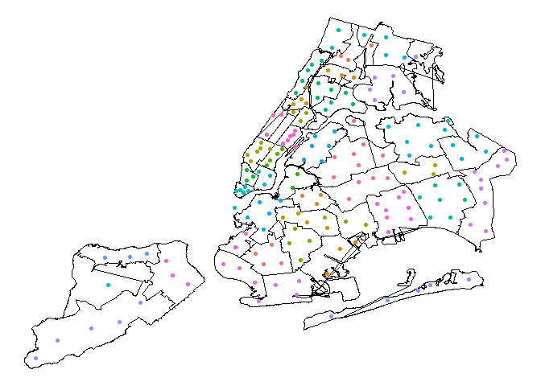

Project Shape Cleaning
================
Gustavo Garcia-Franceschini
2023-11-19

``` r
library(sf)
```

    ## Linking to GEOS 3.11.2, GDAL 3.6.2, PROJ 9.2.0; sf_use_s2() is TRUE

``` r
library(sfheaders)
library(tidyverse)
```

    ## ── Attaching core tidyverse packages ──────────────────────── tidyverse 2.0.0 ──
    ## ✔ dplyr     1.1.3     ✔ readr     2.1.4
    ## ✔ forcats   1.0.0     ✔ stringr   1.5.0
    ## ✔ ggplot2   3.4.3     ✔ tibble    3.2.1
    ## ✔ lubridate 1.9.2     ✔ tidyr     1.3.0
    ## ✔ purrr     1.0.2

    ## ── Conflicts ────────────────────────────────────────── tidyverse_conflicts() ──
    ## ✖ dplyr::filter() masks stats::filter()
    ## ✖ dplyr::lag()    masks stats::lag()
    ## ℹ Use the conflicted package (<http://conflicted.r-lib.org/>) to force all conflicts to become errors

# Air Quality Data

``` r
df_air = read_csv("raw_data/air_quality.csv") %>%
  janitor::clean_names() %>%
  select(-message) %>%
  mutate(id = as.character(geo_join_id)) %>%
  filter(geo_type_name == "UHF42")
```

    ## Rows: 16218 Columns: 12
    ## ── Column specification ────────────────────────────────────────────────────────
    ## Delimiter: ","
    ## chr (7): Name, Measure, Measure Info, Geo Type Name, Geo Place Name, Time Pe...
    ## dbl (4): Unique ID, Indicator ID, Geo Join ID, Data Value
    ## lgl (1): Message
    ## 
    ## ℹ Use `spec()` to retrieve the full column specification for this data.
    ## ℹ Specify the column types or set `show_col_types = FALSE` to quiet this message.

# Shape Files

This code involves:

- loading the shape files using the `sf` package

- loading the `zip_codes` dataset so we can know which of the zip codes
  in the `zip_shapes` dataset are from NYC (as opposed to other parts of
  New York).

- transforming the `zip_shapes` dataset from regular coordinates to
  EPSG:2263

- changing everything to regular datasets for easier plotting

``` r
air_shapes = read_sf(dsn = "raw_shapes/", layer = "UHF42")
```

``` r
zip_codes = read_csv("raw_data/nyc-zip-codes.csv") %>%
  mutate(zip = as.character(ZipCode)) %>%
  select(-ZipCode) %>%
  janitor::clean_names()
```

    ## Rows: 178 Columns: 3
    ## ── Column specification ────────────────────────────────────────────────────────
    ## Delimiter: ","
    ## chr (2): Borough, Neighborhood
    ## dbl (1): ZipCode
    ## 
    ## ℹ Use `spec()` to retrieve the full column specification for this data.
    ## ℹ Specify the column types or set `show_col_types = FALSE` to quiet this message.

``` r
zip_shapes = read_sf(dsn = "raw_shapes/", layer = 'tl_2019_us_zcta510') %>% 
  rename(zip = ZCTA5CE10) %>%
  inner_join(zip_codes) %>%
  st_transform(crs= st_crs(air_shapes)) %>%
  mutate(x_center = map_dbl(geometry, ~st_point_on_surface(.x)[[1]]),
         y_center = map_dbl(geometry, ~st_point_on_surface(.x)[[2]])) %>%
  sf_to_df(fill = T)  %>%
  janitor::clean_names()
```

    ## Joining with `by = join_by(zip)`

``` r
air_shapes = air_shapes %>%
  sf_to_df(fill = T) %>%
  janitor::clean_names() %>%
  mutate(geo_join_id = as.numeric(id)) %>%
  filter(id != "0")
```

# Example map

The map shows the 42 UHF neighborhoods (colors), with the zip code
bounds drawn over the colors.

``` r
ggplot() + geom_polygon(data = air_shapes, 
                        aes(x = x, y = y, group = id), 
                        fill = "white", color = "black") + 
  theme_void() + geom_point(data = zip_shapes, 
                            aes(x = x_center, y = y_center, 
                                color = neighborhood)) + 
  theme(legend.position = "none")
```

<!-- -->

# Joining Air Data with UHF Shape files

Before joining, I think you should make `df_air` smaller (by choosing a
specific year and name to track).

``` r
#df_air_shapes = df_air %>%
#  inner_join(air_shapes, by = "id")
```

# Joining with zip code data

Joining these will be hard because the neighborhoods don’t have the same
names. We don’t have to join them for the maps, but we’d need to join
them for regression.

``` r
sort(unique(df_air$geo_place_name))
```

    ##  [1] "Bayside - Little Neck"               
    ##  [2] "Bedford Stuyvesant - Crown Heights"  
    ##  [3] "Bensonhurst - Bay Ridge"             
    ##  [4] "Borough Park"                        
    ##  [5] "Canarsie - Flatlands"                
    ##  [6] "Central Harlem - Morningside Heights"
    ##  [7] "Chelsea - Clinton"                   
    ##  [8] "Coney Island - Sheepshead Bay"       
    ##  [9] "Crotona -Tremont"                    
    ## [10] "Downtown - Heights - Slope"          
    ## [11] "East Flatbush - Flatbush"            
    ## [12] "East Harlem"                         
    ## [13] "East New York"                       
    ## [14] "Flushing - Clearview"                
    ## [15] "Fordham - Bronx Pk"                  
    ## [16] "Fresh Meadows"                       
    ## [17] "Gramercy Park - Murray Hill"         
    ## [18] "Greenpoint"                          
    ## [19] "Greenwich Village - SoHo"            
    ## [20] "High Bridge - Morrisania"            
    ## [21] "Hunts Point - Mott Haven"            
    ## [22] "Jamaica"                             
    ## [23] "Kingsbridge - Riverdale"             
    ## [24] "Long Island City - Astoria"          
    ## [25] "Lower Manhattan"                     
    ## [26] "Northeast Bronx"                     
    ## [27] "Pelham - Throgs Neck"                
    ## [28] "Port Richmond"                       
    ## [29] "Ridgewood - Forest Hills"            
    ## [30] "Rockaways"                           
    ## [31] "South Beach - Tottenville"           
    ## [32] "Southeast Queens"                    
    ## [33] "Southwest Queens"                    
    ## [34] "Stapleton - St. George"              
    ## [35] "Sunset Park"                         
    ## [36] "Union Square - Lower East Side"      
    ## [37] "Upper East Side"                     
    ## [38] "Upper West Side"                     
    ## [39] "Washington Heights"                  
    ## [40] "West Queens"                         
    ## [41] "Williamsburg - Bushwick"             
    ## [42] "Willowbrook"

``` r
sort(unique(zip_codes$neighborhood))
```

    ##  [1] "Borough Park"                  "Bronx Park and Fordham"       
    ##  [3] "Bushwick and Williamsburg"     "Canarsie and Flatlands"       
    ##  [5] "Central Bronx"                 "Central Brooklyn"             
    ##  [7] "Central Harlem"                "Central Queens"               
    ##  [9] "Chelsea and Clinton"           "East Harlem"                  
    ## [11] "East New York and New Lots"    "Flatbush"                     
    ## [13] "Gramercy Park and Murray Hill" "Greenpoint"                   
    ## [15] "Greenwich Village and Soho"    "High Bridge and Morrisania"   
    ## [17] "Hunts Point and Mott Haven"    "Inwood and Washington Heights"
    ## [19] "Jamaica"                       "Kingsbridge and Riverdale"    
    ## [21] "Lower East Side"               "Lower Manhattan"              
    ## [23] "Mid-Island"                    "North Queens"                 
    ## [25] "Northeast Bronx"               "Northeast Queens"             
    ## [27] "Northwest Brooklyn"            "Northwest Queens"             
    ## [29] "Port Richmond"                 "Rockaways"                    
    ## [31] "South Shore"                   "Southeast Bronx"              
    ## [33] "Southeast Queens"              "Southern Brooklyn"            
    ## [35] "Southwest Brooklyn"            "Southwest Queens"             
    ## [37] "Stapleton and St. George"      "Sunset Park"                  
    ## [39] "Upper East Side"               "Upper West Side"              
    ## [41] "West Central Queens"           "West Queens"

# Exporting air and zip shape files

``` r
write_csv(air_shapes, "cleaned_shapes/air_shapes.csv")

write_csv(zip_shapes, "cleaned_shapes/zip_shapes.csv")
```
